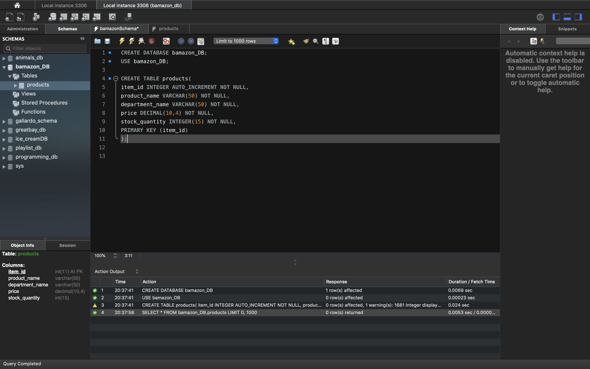
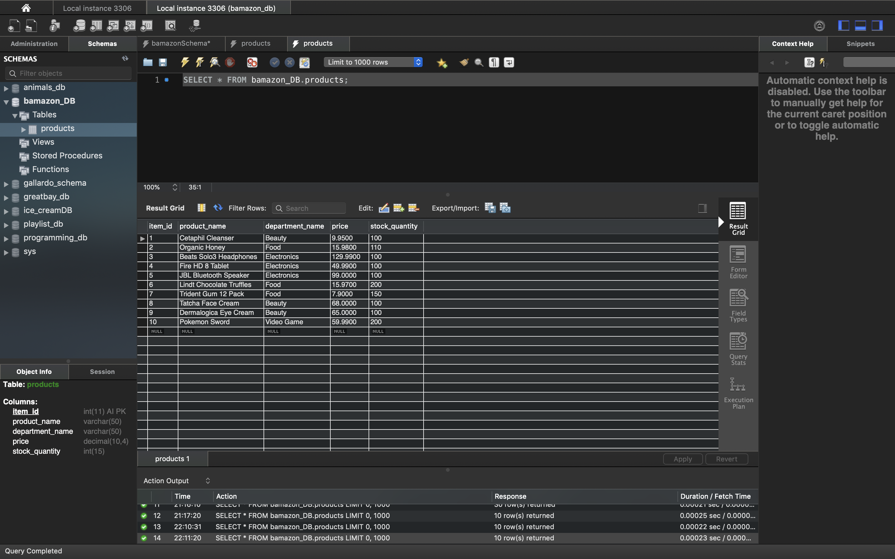
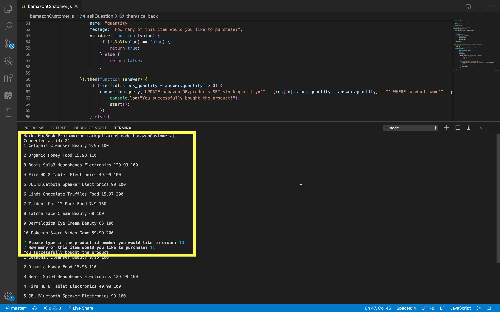

# Bamazon
This is a command-line Node.JS and MySQL application for buying and tracking retail inventory.

## Set Up and Installation
The following must be installedto use Bamazon:

- [Node.js](https://nodejs.org/en/)
- [npm](https://www.npmjs.com/get-npm)
- [MySQL](https://www.mysql.com/)
- [MySQL Workbench](https://www.mysql.com/products/workbench/)

### We first need to use set up our inventory be using MySQL Workbench to create a database of the products we are selling:
#### Creation of our Bamazon databse

#### Creation of our products table

## HOW TO USE BAMAZON:
The command line is: **node bamazonCustomer.js**
1. Notice that it will print out the table that we created from MySQL workbench.
2. Then it will ask the user which item they would like to purchase by typing in the items id number.
3. Next, it wil ask the user the amount they would like to purchase.
4. Once the transaction is completed, the database will update with the new inventory quantity and will be displayed on the terminal.

